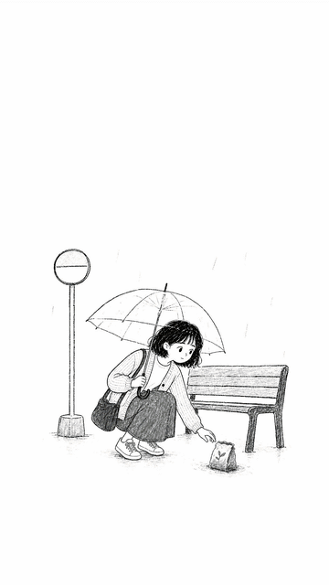
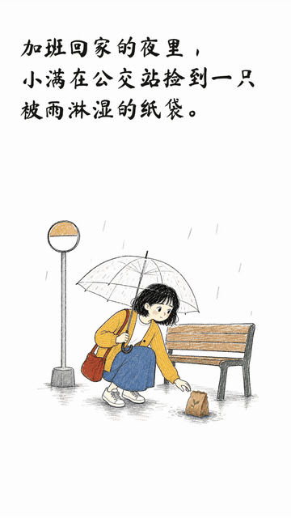

# Story Handdrawn Studio

[](https://github.com/DingYi1024/story-handdrawn-studio/actions/workflows/ci.yml)
[](https://github.com/DingYi1024/story-handdrawn-studio/releases)

面向中文故事和有序图片的自包含 Agent Skill。安装后直接调用 `$story-handdrawn-studio`；Skill 内置项目化 Remotion 渲染器，每个作品拥有独立的原始输入、配置、提示词、素材、状态和输出。

## 一键安装 Skill

从 GitHub 直接安装到 Codex：

```bash
npx skills add https://github.com/DingYi1024/story-handdrawn-studio/tree/main/skill-package/story-handdrawn-studio -g -a codex -y
```

安装到 Claude Code：

```bash
npx skills add https://github.com/DingYi1024/story-handdrawn-studio/tree/main/skill-package/story-handdrawn-studio -g -a claude-code -y
```

也可以同时安装到多个 Agent：

```bash
npx skills add https://github.com/DingYi1024/story-handdrawn-studio/tree/main/skill-package/story-handdrawn-studio -g -a codex -a claude-code -y
```

更新已安装版本：

```bash
npx skills check
npx skills update story-handdrawn-studio -g -y
```

重新加载 Agent 后直接说：

```text
使用 $story-handdrawn-studio 把这段故事制作成 9:16 手绘动画，先生成预览。
```

首次使用会把当前版本渲染器准备到 `~/.story-handdrawn-studio/runtimes/<版本>/` 并安装锁定依赖。所有作品和素材保存在 `~/.story-handdrawn-studio/`，替换或升级 Skill 不会覆盖作品。无需另外克隆本仓库；`STORY_HANDDRAWN_STUDIO_PROJECT` 只用于高级用户主动切换到外部定制渲染器。

Claude Code 也支持通过插件市场安装：

```text
/plugin marketplace add DingYi1024/story-handdrawn-studio
/plugin install story-handdrawn-studio@story-handdrawn-studio
```

如需离线安装，可从 [GitHub Releases](https://github.com/DingYi1024/story-handdrawn-studio/releases) 下载对应版本 ZIP。

## 现在能做什么

- `produce` 自动总导演：从原文/图片一路推进到素材、预览、正式片和机器验收
- Creative Director：从 6 种原创叙事弧和 5 套原创手绘主题中自动推荐，也可先生成 4 张同场景风格试片再确认
- 一幕多镜：长场景自动拆成全景与特写，镜头运动和元素运动分离，并保持旧故事板兼容
- 本地确定性微动画：推拉、平移、视差、雨滴、花瓣、光点、纸片漂浮和墨线呼吸，不依赖 AI 视频模型
- 本地自动声音导演：识别情绪与雨声、脚步、鸟鸣、发现等事件，原创合成 BGM/SFX 并帧级对齐翻页
- 中文故事自动分镜，保留原文并按阅读速度计算镜头时长
- 有序图片自动去重、版式检测、无损包含和黑白层派生
- 首帧直接显示黑白画稿，再叠加文字，最后由左到右揭示彩色插画；没有纯白过渡
- `revise` 指定镜头局部重做，旧版本归档，新素材不覆盖已验收母图
- 角色、服装、道具、场景、时间、配色连续性账本；当前镜头人物必须显式声明，不会串场
- 自动视频 QA：首帧、黑白/彩色时序、尺寸、帧率、时长、音频流、黑白空帧和疑似重复帧
- 转场专项 QA：每次卷页前、中、后抽帧，直接阻止白屏或黑屏过渡
- 语义 QA 与本地审片台：不伪造视觉结论，逐场批准/返修并导出可执行决定
- 可选 OpenAI 旁白或自备旁白/BGM/音效，按真实音频时长校准镜头并混音为 AAC
- `cut` 直切与 `page-flip` 卷页转场；卷页下方直接露出下一幕黑白图，结束后才写字、上色
- 3:4、9:16、1:1、16:9 四种动态画布
- Codex Image2 任务清单与显式选择的 OpenAI API 工作流
- 图片提供方自动选择、费用估算、有界重试和持久化恢复状态
- 5 个创作模板、v4 配置迁移、项目快照、安全回滚，以及 Windows/Linux/macOS CI
- 自然语言意图路由、首次引导、状态导航与预览/正式片机器质检
- 项目锁、原子状态文件、严格素材校验、失败后恢复
- Skill 外持久数据、版本化运行时与不覆盖作品的升级契约
- 10 类连续性回归案例，以及带原创音乐、环境音和翻页音效的完整有声示范片

## 完整案例：《会发芽的纸条》

[](examples/case-sprouting-note/final.mp4)

上方 GIF 只展示画面；点击它即可打开带声音的正式 MP4。案例为 9:16、4 幕、8 镜头、27.5 秒，同一角色贯穿，完整展示 `黑白画稿 → 文字 → 彩色插画`、推拉/平移/视差与局部手绘微动画、三次卷页转场，以及原创背景音乐、雨声、浇水声、鸟鸣和同步翻页声。

三次卷页转场特写：

[](examples/case-sprouting-note/final.mp4)

- [播放或下载 1080×1920 正式 MP4](examples/case-sprouting-note/final.mp4)
- [通过 Raw 地址直接打开 MP4](https://raw.githubusercontent.com/DingYi1024/story-handdrawn-studio/main/examples/case-sprouting-note/final.mp4)
- [查看案例说明与复现命令](examples/case-sprouting-note/README.md)
- [查看故事板 JSON](examples/case-sprouting-note/storyboard.json)
- [查看机器 QA 报告](examples/case-sprouting-note/qa-report.json)
- [打开本地审片台](examples/case-sprouting-note/review.html)
- [查看语义 QA 报告](examples/case-sprouting-note/semantic-report.json)
- [查看音频配置与原创音源](examples/case-sprouting-note/audio-options.json)
- [查看角色与分镜素材](public/examples/case-sprouting-note/)

## 环境

- Node.js 20+
- npm
- FFmpeg 与 FFprobe（可从终端直接调用）
- 首次渲染时 Remotion 会准备兼容的无头浏览器

```bash
npm ci
node scripts/studio.mjs doctor
npm run check
```

## 最短工作流：自动总导演

### 故事文本

```bash
node scripts/studio.mjs produce --id summer --title "纸上的夏天" \
  --input examples/story.txt --preset vertical --to final
```

Codex 路线会在 `awaiting_assets` 返回结构化图片任务；Agent 按任务生成到每个精确的 `output_master` 后，重复运行 `produce --project summer --to final`。它会继续导入、预览、两轮机器 QA 和正式片，不会在只有故事板时假装完成。仍可使用 `create / plan / import / render` 手动控制各阶段。

如明确选择 API 且已设置 `OPENAI_API_KEY`：

```bash
node scripts/studio.mjs produce --project summer --generator api --to final
```

### 有序图片

```bash
node scripts/studio.mjs produce --id diary --title "旅行手账" \
  --image /absolute/01.jpg --image /absolute/02.jpg --preset portrait --to preview
```

Windows PowerShell 同样可逐行运行；反斜杠续行仅用于上面的类 Unix 示例。

### 恢复、检查和列表

```bash
node scripts/studio.mjs resume --project summer
node scripts/studio.mjs status --project summer --json
node scripts/studio.mjs validate --project summer --assets
node scripts/studio.mjs list
```

`resume` 会根据状态继续下一步：故事规划、图片导入、等待生成素材、预览或正式渲染。素材未齐时只报告缺失任务，不伪造完成状态。

### 局部重做

```bash
node scripts/studio.mjs revise --project summer --scene 02 \
  --note "不要出现人物，只保留雨夜空站台和纸袋" --to preview
node scripts/studio.mjs produce --project summer --to preview
```

旧版元数据归档到 `revisions/rN/`；任务使用新的 `-rN` 母图，不覆盖旧图。连续性依赖导致的关联镜头会一并列出。

### 可选音频

不使用密钥、完全在本地自动配乐和配音效：

```bash
node scripts/studio.mjs audio --project summer --action auto
node scripts/studio.mjs produce --project summer --to final
```

需要旁白时再使用 OpenAI TTS 或自备录音：

```bash
node scripts/studio.mjs audio --project summer --action prepare \
  --enable --provider openai --model tts-1-hd --voice alloy
node scripts/studio.mjs produce --project summer --to final
```

也可用 `--voiceover 01=/absolute/01.wav --bgm /absolute/bed.mp3 --sfx 02=/absolute/rain.wav --provider files`。音频默认关闭；OpenAI 旁白需要 `OPENAI_API_KEY`，会把 `scene.narration` 发送到语音接口。

### 模板、素材提供方与审片

```bash
node scripts/studio.mjs templates
node scripts/studio.mjs create --template gentle-diary --id summer --title "纸上的夏天" --input story.txt
node scripts/studio.mjs assets --project summer --action plan --provider auto
node scripts/studio.mjs semantic-qa --project summer
node scripts/studio.mjs review --project summer
node scripts/studio.mjs apply-review --project summer --input /absolute/summer-review.json --to preview
```

`semantic-qa` 在没有真实视觉观察时返回 `needs_review`，不会假装检查通过。`review` 生成自包含 HTML；审片决定只会重做被拒绝的镜头。

### Creative Director 与风格试片

```bash
node scripts/studio.mjs director --project summer --action list
node scripts/studio.mjs director --project summer --action styles
node scripts/studio.mjs director --project summer --action choose --theme warm-diary
node scripts/studio.mjs director --project summer --action plan --force
```

`plan` 默认自动推荐叙事弧、主题和安全的非重复镜头节奏。高成本或风格敏感作品可先运行 `styles`，用同一代表场景生成 4 张候选图，再通过 `choose` 锁定主题。中文正文仍由独立文字层排版，不默认烧进生成图片。

### 快照、迁移与回滚

```bash
node scripts/studio.mjs migrate --project summer
node scripts/studio.mjs snapshot --project summer --label "正式渲染前"
node scripts/studio.mjs rollback --project summer --snapshot s0001
```

迁移前自动备份；回滚前也会创建安全快照，因此恢复操作仍可逆。

## 画幅与配置

| preset | 画幅 | 正式尺寸 | 默认预览 |
| --- | --- | --- | --- |
| `portrait` | 3:4 | 1080×1440 | 720×960 |
| `vertical` | 9:16 | 1080×1920 | 720×1280 |
| `square` | 1:1 | 1080×1080 | 720×720 |
| `landscape` | 16:9 | 1920×1080 | 704×396 |

通过 Skill 创建后，核心参数位于 `~/.story-handdrawn-studio/projects/<id>/project.json`：

- `canvas`：比例、宽高、FPS
- `caption`：每行字数和最大行数
- `timing`：分句、阅读速度、镜头上下限
- `layout`：字幕区、插图区和安全边距的画布比例
- `transition`：转场类型与时长
- `visual`：风格锁、角色锁、配色
- `director`：叙事弧、手绘主题、多镜头与审批策略
- `render`：预览宽度、CRF、并发数

修改后再运行 `validate`；非法比例、奇数尺寸、路径穿越、缺图、图层顺序与字幕溢出会被拒绝。

## 项目目录（Skill 默认数据根）

```text
~/.story-handdrawn-studio/projects/<id>/
├── project.json              # 持久配置
├── state.json                # 状态、错误与操作历史
├── source/                   # 原始故事或图片副本
├── prompts/                  # 每批次提示词
├── director.generated.json   # 总导演计划与镜头版本
├── style-bakeoff.json        # 同场景风格试片任务和选择状态
├── continuity.spec.json      # 可编辑连续性规范
├── continuity.ledger.json    # 编译后的连续性账本
├── storyboard.generated.json # 故事规划结果
├── storyboard.json           # 当前可渲染故事板
├── codex-image-jobs.json     # Codex 图片任务
├── revisions/rN/             # 历次修改归档
├── snapshots/sNNNN/          # 可恢复项目快照
├── provider-state.json       # 提供方、估算、尝试次数与错误
├── semantic-report.json      # 语义策略与视觉观察报告
├── vision-jobs.json          # Agent/人工视觉审查任务
├── review/index.html         # 自包含本地审片台
├── qa/preview|final/         # QA 报告与抽帧
├── audio-options.json        # 可选音频设置
├── audio-manifest.json       # 音轨、时序、实测时长
└── output/                   # preview.mp4 / final.mp4

~/.story-handdrawn-studio/public/projects/<id>/assets/  # 项目独立的运行时素材
```

数据目录不属于 Skill 安装目录，也不随 Skill 升级删除；多个作品不会争用故事板或生成素材。直接开发源码时仍默认使用仓库内的 `projects/` 与 `public/projects/`，也可传入 `--data-root`。

## 开发入口

```bash
npm test                 # Node 单元测试
npm run regress          # 10 类连续性回归案例
npm run check            # 测试、TypeScript、示例故事板结构
npm run check:assets     # 示例故事板连同素材严格检查
npm run build            # Remotion 生产 bundle
npm run dev              # Remotion Studio
npm run package:share    # 生成可分享源码包
```

关键边界：`scripts/lib/` 是纯规则与基础设施，`scripts/studio.mjs` 负责编排，故事板 JSON 是生成端与 `src/` 渲染端之间的稳定契约。扩展路线见 [CUSTOMIZATION.md](CUSTOMIZATION.md)，渲染约束见 [DESIGN.md](DESIGN.md)。

## Agent Skill

可分发 Skill 位于 `skill-package/story-handdrawn-studio/`。它是自包含包，无需设置外部项目路径；只有开发自定义渲染器时才设置 `STORY_HANDDRAWN_STUDIO_PROJECT`。

## 协议

项目代码采用 [MIT](LICENSE)。第三方字体和必要的第三方许可信息分别见字体目录与 [THIRD_PARTY_NOTICES.md](THIRD_PARTY_NOTICES.md)。

---

## English

Story Handdrawn Studio v1.1 turns Chinese stories or ordered images into complete directed hand-drawn Remotion videos with narrative arcs, style bake-offs, deterministic multi-shot motion, automatic local sound design, resumable image providers, continuity ledgers, pixel and semantic QA, a local review UI, snapshots, rollback, and multi-ratio delivery.
