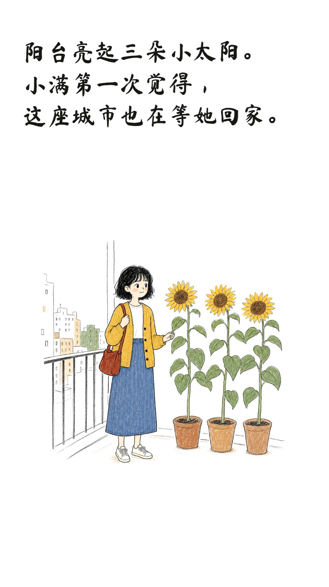

# 案例：会发芽的纸条

这是 Story Handdrawn Studio 的完整 9:16 案例，演示同一角色在四幕故事中的身份一致性，以及字体字幕、黑白线稿和彩色插画的分层揭示。



## 故事

一位在陌生城市独居的女孩，于雨夜捡到三颗向日葵种子。九十天的照料，让她第一次感到这座城市也在等她回家。

## 交付内容

- `story.txt`：故事原文
- `storyboard.json`：可验证的四幕故事板
- `render-props.json`：Remotion 案例渲染参数
- `../../public/examples/case-sprouting-note/00_character_reference.png`：固定角色设定
- `../../public/examples/case-sprouting-note/*_color.png`：ImageGen 彩色场景母图
- `../../public/examples/case-sprouting-note/*_bw.png`：FFmpeg 本地派生黑白层
- `preview.mp4`：720×1280 审片版
- `final.mp4`：1080×1920 H.264 正式片
- `cover.png`：从正式片末幕提取的案例封面

## 本地复现

```bash
npm ci
node scripts/validate-storyboard.mjs examples/case-sprouting-note/storyboard.json
npx remotion render src/index.ts ProjectVideo examples/case-sprouting-note/preview.mp4 \
  --props=examples/case-sprouting-note/render-props.json \
  --public-dir=public --codec=h264 --pixel-format=yuv420p --crf=23 --scale=0.6666666667 --muted --concurrency=1
npx remotion render src/index.ts ProjectVideo examples/case-sprouting-note/final.mp4 \
  --props=examples/case-sprouting-note/render-props.json \
  --public-dir=public --codec=h264 --pixel-format=yuv420p --crf=18 --muted --concurrency=1
```

正式片为静音画面轨，可在后期增加旁白、音乐和音效。
